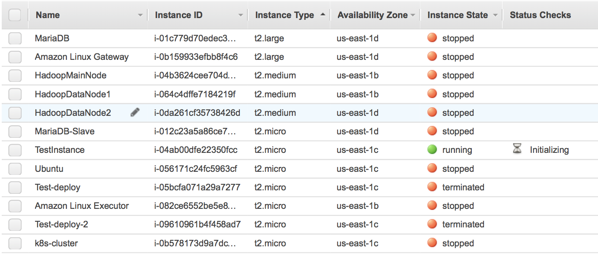

# ansible-aws-instance
Launch/Configuire AWS EC2 Instances and Security Groups Using Ansible and Configure/Startup Applications.

This project contains the Ansible inventories, playbooks, and templates needed to manage EC2 instances and individual applications.

## Create the IAM User

Under the _IAM_ section go to _Users_ and the click on _Add user_ to create a user specifically for this role. In my case, I named it _admin_ and set _Access type_ as shown below:


 Next, attach a policy broad enough to allow instance creation/modification:
 
 
 
 Finally, create and download the generated access keys (these will be saved to a _credentials.csv_ file) to be used with the playbook:
 
 


## Install Ansible

The Ansible Playbooks will be run from a _control_ server (in my case, a MacBook Pro) that is _ssh_ enabled. They are of course checked into this git repository under the _ansible_ directory.

### Ansible Installation

Review your OS-specific installation instructions. For the Mac OS I used the below commands:
```
sudo pip install --upgrade pip
sudo pip install ansible
```
The second command installs the following packages: MarkupSafe-1.1.1 ansible-2.9.7 cffi-1.14.0 cryptography-2.9.2 enum34-1.1.10 ipaddress-1.0.23 jinja2-2.11.2 pycparser-2.20

Note that I am using Python 2.7.x which will work for now but is officially not longer supported as of 2020.

You can also run _ansible --version_ to get specific information about the installation:
```
ansible 2.9.7
  config file = None
  configured module search path = [u'/Users/stuartpineo/.ansible/plugins/modules', u'/usr/share/ansible/plugins/modules']
  ansible python module location = /Library/Python/2.7/site-packages/ansible
  executable location = /usr/local/bin/ansible
  python version = 2.7.10 (default, Jul 15 2017, 17:16:57) [GCC 4.2.1 Compatible Apple LLVM 9.0.0 (clang-900.0.31)]v
```

In addition to Ansible we will use _boto_ and _boto3_, Python interfaces to AWS implementing the _ec2_ and _ec2_group_ modules (installation/dependencies shown below):
```
pip install boto boto3
...
Successfully installed boto-2.49.0 boto3-1.13.8 botocore-1.16.8 s3transfer-0.3.3 urllib3-1.25.
```

Then create the _.boto_ file in your home directory with the below contents (this is the access key information you downloaded to the CSV file) ensuring that the file permissions are set to _400_ (alternatively, you can also reference these keys in your playbook as I will show):
```
[Credentials]
aws_access_key_id = YOURACCESSKEY
aws_secret_access_key = YOURSECRETKEY
```

## Spin up an AWS Instance: Configure the Inventory File and Run the EC2 Instance Playbook

The [_ansible_](ansible) directory in this repository contains the [_playbooks/ec2_instance.yml_](ansible/playbooks/ec2_instance.yml) generic playbook to spin up the instance and the [_inventories/ec2_instance.template_](ansible/inventories/ec2_instance.template) that can be used to create the inventory file.

Once the inventory file (i.e., _inventories/ec2_instance_) values are in place from the _ansible_ subdirectory run the command (output follows):
```
ansible-playbook -i inventories/ec2_instance playbooks/ec2_instance.yml

PLAY [EC2 Instance] ****************************************************************************************************************************************************************************

TASK [Gathering Facts] *************************************************************************************************************************************************************************
ok: [localhost]

TASK [Launch EC2 Instance] *********************************************************************************************************************************************************************
changed: [localhost]

PLAY RECAP *************************************************************************************************************************************************************************************
localhost                  : ok=2    changed=1    unreachable=0    failed=0    skipped=0    rescued=0    ignored=0
```

Navigating to the _EC2 Dashboard_ you can check the status of the instance (in this case _TestInstance_):



Since I spun up an Ubuntu instance, I can now access this instance from an SSH-enabled terminal using the _ubuntu_ user:
```
ssh -i /keypath/mykey.pem ubuntu@ec2-xxx-xxx-xxx-xxx.compute-1.amazonaws.com
```

## Ansible Configuration: Automated AccumuloConfiguration/Start-up of Zookeeper, Hadoop, and Accumulo

### Create the EC2 Security Group

To create/update the 'ZK-HA-AC-Restrictive' security group (assuming the instances are already running) first create a inventory file from the [_template_](ansible/inventories/zk_ha_ac_conf.template) and then run the [_playbook_](ansible/playbooks/zk_ha_ac_group.yml). From the [_ansible_](ansible) subdirectory:
```
ansible-playbook -i ./inventories/zk_ha_ac_conf ./playbooks/zk_ha_ac_group.yml
```

### Start/Stop the Instances

The _instance_id_ for the cluster instances should be added to the [_zk_ha_ac_config_](ansible/inventories/zk_ha_ac_conf.template) inventory file. The playbooks [_start_](ansible/playbooks/zk_ha_ac_start.yml) and [_stop_](ansible/playbooks/zk_ha_ac_stop.yml) can then be run to start/stop the cluster instances:
```
ansible-playbook -i ./inventories/zk_ha_ac_conf ./playbooks/zk_ha_ac_start.yml
ansible-playbook -i ./inventories/zk_ha_ac_conf ./playbooks/zk_ha_ac_stop.yml
```

### Stop/Starting Instances and attaching the Security Group

The 'instances' playbook initializes the security group, stops/starts the instances (attaching the security group), and adds the restrictive rules to the security group based on the new instance information (such as new public IPs). To set this up, modify the [_zk_ha_ac_conf_](ansible/inventories/zk_ha_ac_conf.template) inventory template and then run the [_playbook_](ansible/playbooks/zk_ha_ac_instances.yml):
```
ansible-playbook -i ./inventories/zk_ha_ac_conf ./playbooks/zk_ha_ac_instances.yml
```

### Generating the 'servers' File

The [_servers_](ansible/playbooks/zk_ha_ac_servers.yml) playbook queries the running EC2 instances (based on instance ids) for the public/private DNS names and generates the 'servers' file in the _inventories_ directory. Execute using the same inventory file used previously:
```
ansible-playbook -i ./inventories/zk_ha_ac_conf ./playbooks/zk_ha_ac_servers.yml
```

### Generate the '.aliases' File (optional)

This file gets sourced by the _.bashrc_ to create simple to invoke aliases to SSH into the servers and create SSH tunnels to access the Web applications (since my own cluster is, under optimal conditions, locked down to use exclusively private DNS names leaving only port 22 opened externally to the /32 network mask)


### Running the Application Playbooks

Before starting, you will need to create an _ansible_hosts_ (or whatever name you choose) inventory file which you can copy/modify from the [_ansible/inventories/ansible_hosts.template_](ansible/inventories/ansible_hosts.template) checked into this repository (the server values are the Public DNS or IP). In addition, the [_server_](ansible/inventories/server.template) file should include the hosts (it can be generated dynamically). You probably will not need to modify any of the _playbooks_ or _templates_ though its probably good to review them before a deployment in case you need to extend or modify the configuration.

Once done, you can test it by running _ansible servers -m ping -i ./inventories/servers_ to verify that instances are up. If successful, you should output similar to the one below for each instance pinged:
```
ec2-xxx-xxx-xxx-xx1.compute-1.amazonaws.com | SUCCESS => {
    "ansible_facts": {
        "discovered_interpreter_python": "/usr/bin/python"
    }, 
    "changed": false, 
    "ping": "pong"
}
```

To run the [_zookeeper_conf_](ansible/playbooks/zookeeper_conf.yml) playbook which ensures that the configuration contains the right hosts (and other values listed) as well as restarting the daemons ([_zookeeper_daemons_](ansible/playbooks/zookeeper_daemons.yml) on each host run below commands: 
```
cd ansible
ansible-playbook  -i ./inventories/servers -i ./inventories/ansible_hosts ./playbooks/zookeeper_conf.yml
ansible-playbook  -i ./inventories/servers -i ./inventories/ansible_hosts ./playbooks/zookeeper_daemons.yml
```
You will see output associated with each task, but if all goes well will get a _play recap_ at the end showing the successful completion status.
```
PLAY RECAP *************************************************************************************************************************************************************************************
ec2-xxx-xxx-xxx-xxx.compute-1.amazonaws.com : ok=6    changed=3    unreachable=0    failed=0    skipped=0    rescued=0    ignored=0   
ec2-xxx-xxx-xxx-xxx.compute-1.amazonaws.com : ok=6    changed=2    unreachable=0    failed=0    skipped=0    rescued=0    ignored=0   
ec2-xxx-xxx-xxx-xxx.compute-1.amazonaws.com : ok=6    changed=2    unreachable=0    failed=0    skipped=0    rescued=0    ignored=0
```

Similarly to run the [_hadoop_](ansible/playbooks/hadoop_conf.yml) playbook (which is primarily template driven) execute:
```
ansible-playbook -i ./inventories/servers -i ./inventories/ansible_hosts ./playbooks/hadoop_conf.yml
```

To start up DFS and YARN daemons there is a separate [_playbook_](ansible/playbooks/hadoop_daemons.yml) that can be executed:
```
ansible-playbook -i ./inventories/servers -i ./inventories/ansible_hosts ./playbooks/hadoop_daemons.yml
```

The hadoop playbook not only overwrites the configuration files listed in the playbook but also sets up the SSH configuration and executes the commands to stop/start DFS and YARN.


To run the [_accumulo_](ansible/playbooks/accumulo_conf.yml) playbook execute:
```
ansible-playbook  -i ./inventories/servers -i ./inventories/ansible_hosts ./playbooks/accumulo_conf.yml
```

For now, this playbook only configures the _accumulo.properties_, _accumulo-client.properties_ and initializes the _accumulo_ user _.bashrc_ (all functionality template driven)

## Ansible References
* https://docs.ansible.com/ansible/latest/modules/ec2_module.html
* https://docs.ansible.com/ansible/latest/modules/ec2_instance_module.html
* https://docs.ansible.com/ansible/latest/modules/ec2_group_module.html
* https://docs.ansible.com/ansible/latest/modules/ec2_instance_info_module.html
* https://docs.ansible.com/ansible/2.4/playbooks_loops.html#nested-loops

