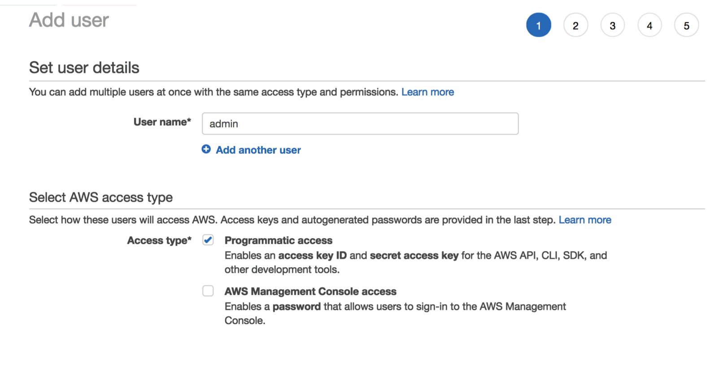
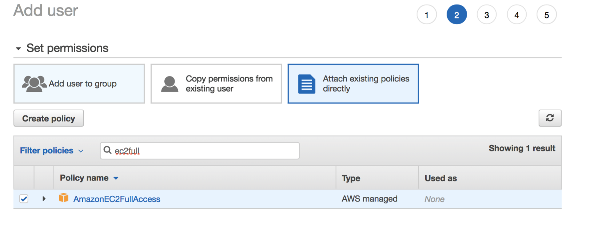
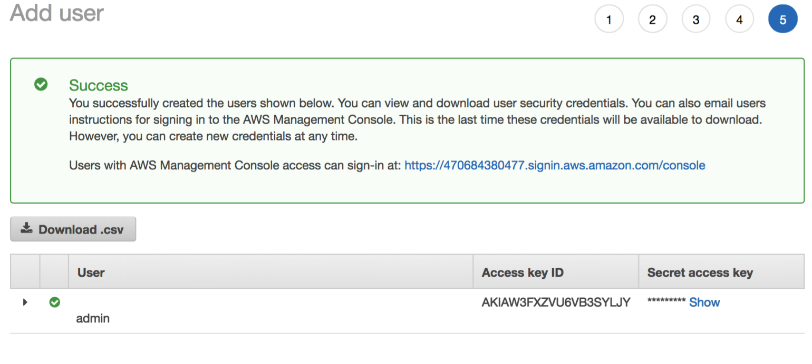

# ansible-aws-instance
Launch AWS EC2 Instances Using Ansible

This project defines the Ansible Inventory and Playbook to launch an AWS EC2 instance. This project assumes that you already have an AWS account.

## Create the IAM User

Under the _IAM_ section go to _Users_ and the click on _Add user_ to create a user specifically for this role. In my case, I named it _admin_ and set _Access type_ as shown below:



 Next, attach a policy broad enough to allow instance creation/modification:
 
 
 
 Finally, create and download the generated access keys (these will be saved to a _credentials.csv_ file) to be used with the playbook:
 
 


## Install Ansible

The Ansible Playbooks will be run from a _control_ server (in my case, a MacBook Pro) that is _ssh_ enabled. They are of course checked into this git repository under the _ansible_ directory.

### Ansible Installation

Review your OS-specific installation instructions. For the Mac OS I used the below commands:
```
sudo pip install --upgrade pip
sudo pip install ansible
```
The second command installs the following packages: MarkupSafe-1.1.1 ansible-2.9.7 cffi-1.14.0 cryptography-2.9.2 enum34-1.1.10 ipaddress-1.0.23 jinja2-2.11.2 pycparser-2.20

Note that I am using Python 2.7.x which will work for now but is officially not longer supported as of 2020.

You can also run _ansible --version_ to get specific information about the installation:
```
ansible 2.9.7
  config file = None
  configured module search path = [u'/Users/stuartpineo/.ansible/plugins/modules', u'/usr/share/ansible/plugins/modules']
  ansible python module location = /Library/Python/2.7/site-packages/ansible
  executable location = /usr/local/bin/ansible
  python version = 2.7.10 (default, Jul 15 2017, 17:16:57) [GCC 4.2.1 Compatible Apple LLVM 9.0.0 (clang-900.0.31)]v
```

In addition to Ansible we will use _boto_ which is specific to the AWS EC2 access. First install:
```
pip install boto
Collecting boto
  Downloading boto-2.49.0-py2.py3-none-any.whl (1.4 MB)
     |████████████████████████████████| 1.4 MB 1.6 MB/s 
Installing collected packages: boto
Successfully installed boto-2.49.0
```

Then create the _.boto_ file in your home directory with the below contents (this is the access key information you downloaded to the CSV file) ensuring that the file permissions are set to _400_ (alternatively, you can also reference these keys in your playbook as I will show):
```
[Credentials]
aws_access_key_id = YOURACCESSKEY
aws_secret_access_key = YOURSECRETKEY
```

## Create and Run the Playbook

The _ansible_ directory in this repository contains the  generic playbook to spin up the instance and the _inventories/ec2-instance.template_
